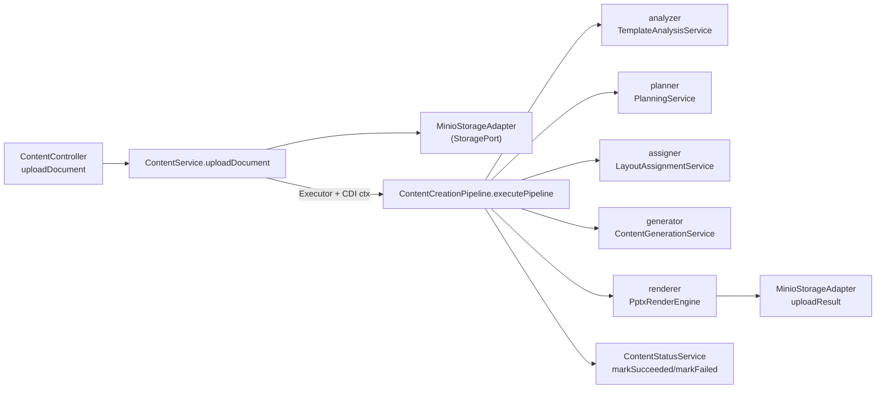

# Architecture — pptx_generator

> Généré à partir d'une inspection réelle du dépôt (worktree) à la date du jour.
> Chaque affirmation importante cite un fichier réel. Toute règle est étiquetée
> `OBSERVÉE`, `SUPPOSÉE` ou `À VALIDER`.

---

## 1. Vue d'ensemble

Application Java 21 / Quarkus 3.8.1 qui expose une API REST de génération de
présentations PowerPoint pilotée par IA. Le cœur est un **pipeline séquentiel en
5 étapes** (M1–M5) qui part d'un template `.pptx` + des instructions et produit un
`.pptx` final :

1. **M1 Analyse du template** → `pipeline/analyzer` (`TemplateAnalysisService`)
2. **M2 Planification** → `pipeline/planner` (`PlanningService`)
3. **M3 Assignation des layouts** → `pipeline/assigner` (`LayoutAssignmentService`)
4. **M4 Génération de contenu** → `pipeline/generator` (`ContentGenerationService`)
5. **M5 Rendu PPTX** → `pipeline/renderer` (`PptxRenderEngine`)

L'orchestration est assurée par `pipeline/ContentCreationPipeline.executePipeline()`
(`src/main/java/com/pptxgenerator/pipeline/ContentCreationPipeline.java:102`).

Ce n'est **pas** une architecture hexagonale/DDD complète : l'hexagone se limite à
l'interface de stockage `StoragePort` (voir §4). L'accès données utilise
**Quarkus Panache** (`PanacheEntityBase` / `PanacheRepositoryBase`), pas un JPA
« classique ».

> ⚠️ État du worktree : le dépôt est en pleine **refonte en cours** (git status
> montre de nombreux fichiers supprimés dans `analyzer/`, `assigner/`, `planner/`,
> `renderer/`, `generator/` au niveau racine, remplacés par de nouveaux fichiers
> **non commités** sous `pipeline/...`). Le code compile (`mvn compile` OK) mais
> aucun test n'existe dans l'arbre de travail. Voir §9.

---

## 2. Modules

**OBSERVÉE** — Un seul module Maven, artifact `pptx-generator`, packaging `jar`
(`pom.xml:8-10`). Pas de multi-modules Gradle/Maven.

- Build : Maven (`pom.xml`)
- Java 21 (`pom.xml:13-14`)
- Gestion de versions par `quarkus-bom` importé en BOM (`pom.xml:24-33`)

Dossiers non-Maven (scratch / hors build, à ne pas confondre avec le code de
production) :
- `rendererbpce/` — prototype renderer sous `fr.bpce...` (package différent de `com.pptxgenerator`)
- `other_codes/` — fichiers `deepseek_java_*.java` isolés
- `python_poc/` — POC Python (step1_planning.py, step2_layout.py, …)
- `src/main/java/MinimalRenderer.java`, `PoiRealisticRenderer.java` — mains standalone dans le package par défaut

Ces dossiers ne sont référencés par aucun code de `com.pptxgenerator`. **SUPPOSÉE**
(leur statut exact — prototype jetable vs code de référence — est à trancher).

---

## 3. Packages et responsabilités (package racine `com.pptxgenerator`)

| Package | Responsabilité | Fichier représentatif |
|---|---|---|
| `api` | Controllers REST (RESTEasy Reactive) | `api/ContentController.java` |
| `service` | Logique applicative, orchestration API | `service/ContentService.java`, `service/ContentStatusService.java` |
| `pipeline` | Orchestration du pipeline M1–M5 | `pipeline/ContentCreationPipeline.java` |
| `pipeline/analyzer` | M1 : analyse du template | `pipeline/analyzer/TemplateAnalysisService.java` |
| `pipeline/planner` | M2 : plan + sous-package `model` | `pipeline/planner/PlanningService.java` |
| `pipeline/assigner` | M3 : layouts + `ai/` + `model/` | `pipeline/assigner/LayoutAssignmentService.java` |
| `pipeline/generator` | M4 : contenu + `model/` | `pipeline/generator/ContentGenerationService.java` |
| `pipeline/renderer` | M5 : rendu + `model/` | `pipeline/renderer/PptxRenderEngine.java` |
| `client` | Gateway IA (OpenRouter/Groq/mock) + `dto/` + `helper/` | `client/GenerativeAiGateway.java` |
| `common/ai` | Parser, executor IA, bibliothèque de prompts | `common/ai/AiCallExecutor.java` |
| `common/exception` | Exceptions de domaine pipeline | `common/exception/AIPipelineException.java` |
| `dto/request`, `dto/response` | DTOs API (snake_case Jackson) | `dto/request/CreateContentRequest.java` |
| `entity` | Entités Panache | `entity/Content.java`, `entity/Template.java` |
| `repository` | Repositories Panache | `repository/ContentRepository.java` |
| `mapper` | Mapping MapStruct (CDI) | `mapper/ContentMapper.java` |
| `model` | Modèles de domaine + `model/enums` | `model/Zone.java`, `model/TemplateAnalysis.java` |
| `storage` | Port (`StoragePort`) + adaptateur MinIO | `storage/MinioStorageAdapter.java` |
| (vide) `config` | Aucune classe | — |

---

## 4. Couches observées

**OBSERVÉE** — une stratification en 4 zones (déduite des dépendances de paquet) :

1. **Présentation** : `api` (Controllers) → dépend de `service`, `dto`.
2. **Application** : `service` → dépend de `entity`, `repository`, `mapper`, `dto`,
   `storage:StoragePort`, `pipeline`.
3. **Domaine / Pipeline** : `pipeline`, `model`, `common` (contient la logique métier).
4. **Infrastructure / Delivery** : `client` (IA), `storage` (MinIO), `repository` (Panache).

Les contrats d'action dépendent vers l'intérieur :
- `service/ContentService.java:34` ne dépend que de `StoragePort` (interface), pas de MinIO.
- `pipeline/ContentCreationPipeline.java:44` dépend de `StoragePort` (interface).
- `storage/MinioStorageAdapter.java:15` implémente `StoragePort`.

Le reste du code (services, pipeline) dépend **directement** des classes concrètes
Panache / de l'IA, sans port. **SUPPOSÉE** — la découpe « couches » est une lecture
par les dépendances ; il n'y a pas de couche `application` explicite distincte des services.

---

## 5. Dépendances entre couches

**OBSERVÉE** (`import` réels) :

```
api (ContentController)
  └─> service.ContentService          (ContentController.java:24)
        ├─> repository.ContentRepository  (Panache)
        ├─> mapper.ContentMapper
        ├─> storage.StoragePort
        └─> pipeline.ContentCreationPipeline  (ContentService.java:35)
              ├─> storage.StoragePort
              ├─> repository.ContentRepository
              ├─> service.ContentStatusService
              ├─> pipeline.analyzer / planner / assigner / generator / renderer
```

Direction du flux (synchronisation) :
- Le contrôleur → service → (déclenche) pipeline en **arrière-plan** via `ExecutorService`
  (`service/ContentService.java:113-130`), avec activation manuelle du contexte CDI
  `Arc.container().requestContext().activate()`.
- Le pipeline orchestre M1→M5 séquentiellement (`ContentCreationPipeline.java:119-159`).

Cycle de vie de l'état : le statut `Content` est mis à jour par `ContentStatusService`
(`service/ContentStatusService.java`), appelé depuis le pipeline.

---

## 6. Deux flux d'appel réels

### Flux A — Création d'une génération de contenu (synchrone)
1. `POST /contentCreation/v1/contents` → `ContentController.createContent()`
   (`api/ContentController.java:29-42`).
2. → `ContentService.createContent()` (`service/ContentService.java:50-79`) :
   génère `contentId`, détermine statut initial (`determineInitialStatus`), crée l'entité
   via `ContentMapper.toEntity`, persiste via `ContentRepository.save`.
3. Réponse `201` avec `ContentResponse` (inclut la signature pour l'upload document).

### Flux B — Pipeline complet (asynchrone, M1–M5)
1. `POST /contents/{id}/document` → `ContentController.uploadDocument()`
   (`api/ContentController.java:44-64`).
2. → `ContentService.uploadDocument()` (`service/ContentService.java:81-134`) :
   upload MinIO via `StoragePort.uploadTemplate`, passe le statut à `QUEUED`, soumet le
   **pipeline en thread dédié**.
3. → `ContentCreationPipeline.executePipeline()` (`pipeline/ContentCreationPipeline.java:102-181`) :
   - M1 : `templateAnalysisService.analyze(pptx)` (`:121`)
   - M2 : `planningService.generatePlan(...)` (`:139`)
   - M3 : `layoutAssignmentService.assignLayouts(plan, analysis)` (`:145`)
   - M4 : `contentGenerationService.generateContent(...)` (`:150`)
   - M5 : `pptxRenderEngine.render(...)` (`:157`)
   - Upload du résultat via `StoragePort.uploadResult` (`:165`), puis
     `statusService.markSucceeded(...)` (`:169`).
4. En cas d'échec : `markFailed` dans le `catch` (`:91`) et dans `ContentService`
   (`:122-126`).
5. `GET /contents/{id}` → `ContentController.getContent()` → `ContentService.getContent()`
   (`api/ContentController.java:66-85`) pour lire le statut.

---

## 7. Patterns réellement observés

- **Controllers RESTEasy Reactive + Jakarta RS** : `@Path`, `@Produces`, `@Consumes`,
  `@RestForm`, `FileUpload` (`api/ContentController.java`). Pas de Spring.
- **CDI Quarkus (ArC)** : `@ApplicationScoped` sur services, repos, pipeline, adapter
  (`service/ContentService.java:26`, `pipeline/ContentCreationPipeline.java:37`).
  Injection par **constructeur** (pas de `@Inject` champs dans la plupart des cas) et par
  `@RequiredArgsConstructor` (Lombok) pour les classes du pipeline/client.
- **Injection par constructeur** : `ContentController(ContentService)` (`:25`),
  `ContentService(ContentRepository, ...)` (`:38`), et via Lombok
  `@RequiredArgsConstructor` (`client/GenerativeAiGateway.java:8`, `pipeline/planner/PlanningService.java:15`).
- **Préparateur de production conditionnel d'interface IA** : `GenerativeAiApiProducer`
  produit `GenerativeAiApi` en fonction de `app.ai.mock` / `app.ai.provider`
  (`client/GenerativeAiApiProducer.java:24-36`).
- **Port / Adapter (limité au stockage)** : interface `StoragePort` + impl `MinioStorageAdapter`
  (`storage/StoragePort.java`, `storage/MinioStorageAdapter.java:15`).
- **Panache** : `PanacheEntityBase` (`entity/Content.java:21`), `PanacheRepositoryBase`
  (`repository/ContentRepository.java:11`).
- **Mapper MapStruct en mode CDI** : `@Mapper(componentModel = "cdi")`
  (`mapper/ContentMapper.java:19-21`), avec mappings nommés (`@Named`) pour sérialiser/parser du JSON.
- **DTO Lombok + Jackson** : `@Data @Builder @NoArgsConstructor @AllArgsConstructor` +
  `@JsonProperty` pour snake_case (`dto/request/CreateContentRequest.java`, `model/Zone.java:27`).
- **Pipeline 5 étapes orchestré** : étapes séquentielles avec debug JSON intermédiaire
  (`pipeline/ContentCreationPipeline.java:119-159`, `writeDebugJson`).
- **Déterminisme + fallback + validateur** par étape : p.ex. `LayoutAssignmentService`
  combine assigner déterministe + IA + fallback + validation
  (`pipeline/assigner/LayoutAssignmentService.java:97-122`).
- **Validation métier** : `PlanValidator` (règles N1–N6), `ContentValidator`,
  `LayoutAssignmentValidator` (suffixe `*Validator`).
- **Prompts construits par `*PromptBuilder`** : `PlanningPromptBuilder`,
  `LayoutAssignmentPromptBuilder`, `ContentPromptBuilder`, surchargés via `SystemPromptLibrary`.
- **Gestion d'erreur JSON en dur** dans le contrôleur : `"{\"error\": \"" + e.getMessage() + "\"}"`
  (`api/ContentController.java:39,61,82,109`).
- **Logger JBoss/Quarkus** : `org.jboss.logging.Logger` dans les classes API/service/pipeline,
  **Lombok `@Slf4j`** dans les classes plugin client/domaine.

---

## 8. Fichiers de référence

- API : `api/ContentController.java`
- Service applicatif : `service/ContentService.java`, `service/ContentStatusService.java`
- Orchestration : `pipeline/ContentCreationPipeline.java`
- Étapes : `pipeline/analyzer/TemplateAnalysisService.java`, `pipeline/planner/PlanningService.java`,
  `pipeline/assigner/LayoutAssignmentService.java`, `pipeline/generator/ContentGenerationService.java`,
  `pipeline/renderer/PptxRenderEngine.java`
- Différentiels IA : `client/GenerativeAiGateway.java`, `client/GenerativeAiApiProducer.java`,
  `common/ai/AiCallExecutor.java`, `common/ai/AiResponseParser.java`
- Persistance : `entity/Content.java`, `repository/ContentRepository.java`, `mapper/ContentMapper.java`
- Stockage : `storage/StoragePort.java`, `storage/MinioStorageAdapter.java`
- Config : `src/main/resources/application.properties`, `src/test/resources/application.properties`
- Schéma : `src/main/resources/db/migration/V1.0__create_initial_schema.sql`

---

## 9. Incohérences / zones incertaines

1. **`AGENTS.md` ne reflète plus le code** (OBSERVÉ) : il décrit des packages
   `analyzer/`, `planner/`, `assigner/`, `generator/`, `renderer/` au niveau racine,
   un `TemplateController`, un `TemplateService`, un `StorageService` — aucun n'existe
   aujourd'hui. Le code réel est sous `pipeline/...`, il n'y a **pas** de `TemplateController`,
   ni `TemplateService`, ni `StorageService` (renommé en `StoragePort`/`MinioStorageAdapter`).
   AGENTS.md doit être mis à jour. **À VALIDER**.
2. **Refonte non commitée** (OBSERVÉ via `git status`) : nouveaux fichiers `pipeline/...`
   non suivi ; anciens fichiers racine supprimés. Le code compile mais l'historique est
   incohérent avec le worktree. **À VALIDER** (faut-il conserver/valider cette refonte ?).
3. **`docs/TESTING.md` et `AGENTS.md` décrivent des tests inexistants** : `src/test/java`
   est **vide** (0 fichier `.java` de test dans l'arbre de travail). Les classes citées
   (`ZoneKeysTest`, `PlaceholderMapperIntegrationTest`, `PptxRenderEngineManualTest`, …)
   ont été supprimées selon `git status` (`D src/test/java/...`). Aucun test ne tourne
   actuellement. **À VALIDER**.
4. **Gestion d'erreur (résolue)** : un `ApiExceptionMapper` (`common/exception/ApiExceptionMapper.java`) +
   `ApiError` + `NotFoundException` produit désormais la réponse `{ "error": { "code", "message" } }`.
   L'ancien JSON assemblé à la main dans `ContentController` a été remplacé par des exceptions.
5. **Async média** : le pipeline est lancé sur `ExecutorService` + activation CDI manuelle
   (`service/ContentService.java:113-130`) plutôt qu'avec `@Asynchronous`/Mutiny. La méthode
   `ContentCreationPipeline.processAsync` existe mais **n'est pas utilisée** (recherche :
   seul le flux `executePipeline` est appelé). **OBSERVÉE** — fonction morte probable.
6. **Config `app.ai.mock=false`** en prod par défaut (`application.properties:30`) alors que
   les tests passent à `true` (`src/test/resources/application.properties:13`). **À VALIDER**
   (dépend de l'existence d'une vraie clé API).
7. **Logging unifié désormais en `@Slf4j`** : les 4 fichiers qui utilisaient
   `org.jboss.logging.Logger` (`ContentService`, `ContentCreationPipeline`,
   `MinioStorageAdapter`, `ContentController`) ont été migrés vers Lombok `@Slf4j`. **OBSERVÉE** —
   convention unique à respecter désormais.
8. **Constructeurs d'`ObjectMapper` dupliqués** : plusieurs services/classes créent leur
   propre `new ObjectMapper()` (`service/ContentService.java:45`, `pipeline/ContentCreationPipeline.java:51,56`)
   au lieu d'injecter le CDI. **OBSERVÉE**.
9. **Config vide** : package `config/` sans classe. **SUPPOSÉE** (inutile ou non implémenté).
10. **doc commentaires mélangés FR/EN** : code en anglais, commentaires/JavaDoc tantôt en
    français (`PlanningService.java`) tantôt en anglais (`PptxRenderEngine.java`). **OBSERVÉE**.

---

## Diagramme Mermaid (flux B — pipeline M1–M5)


