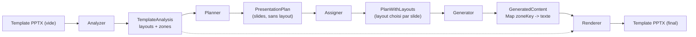
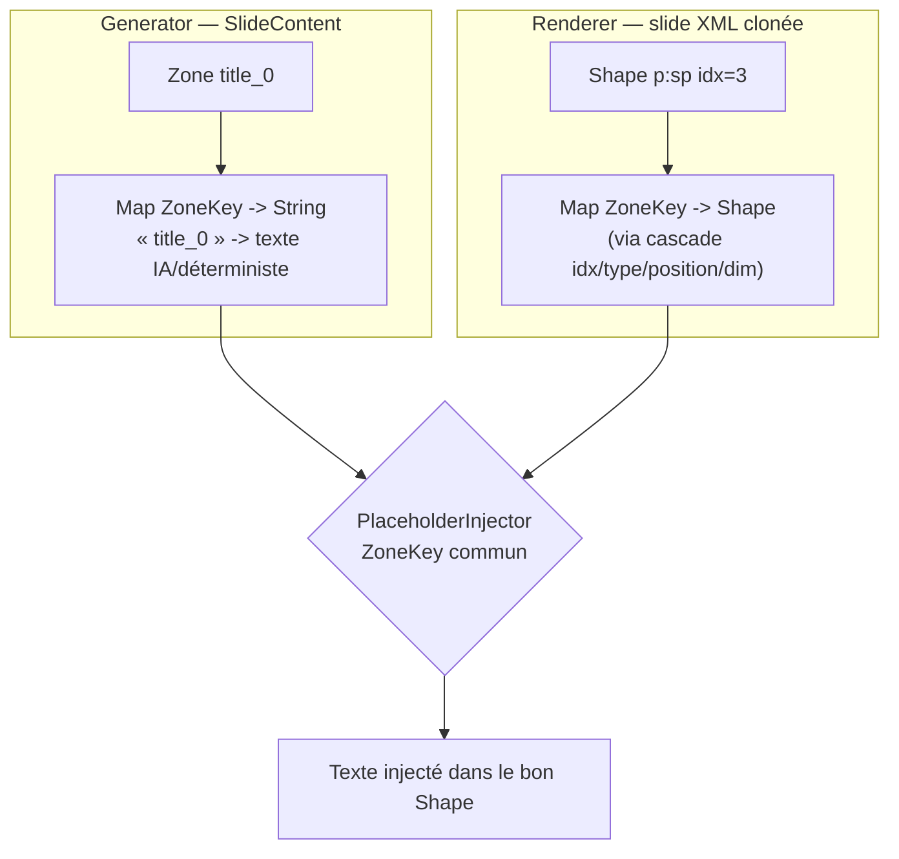
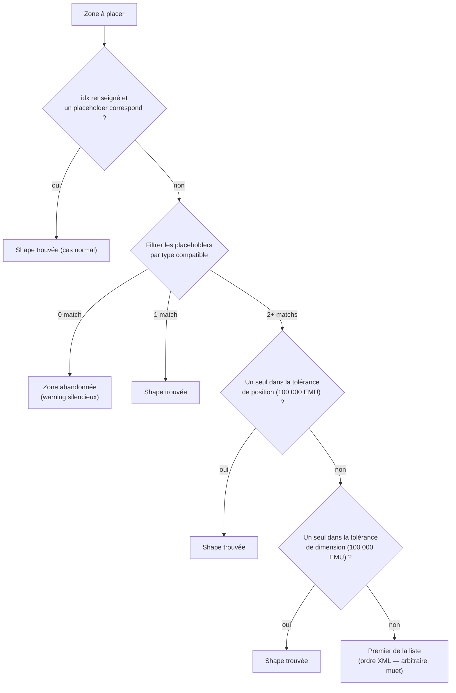
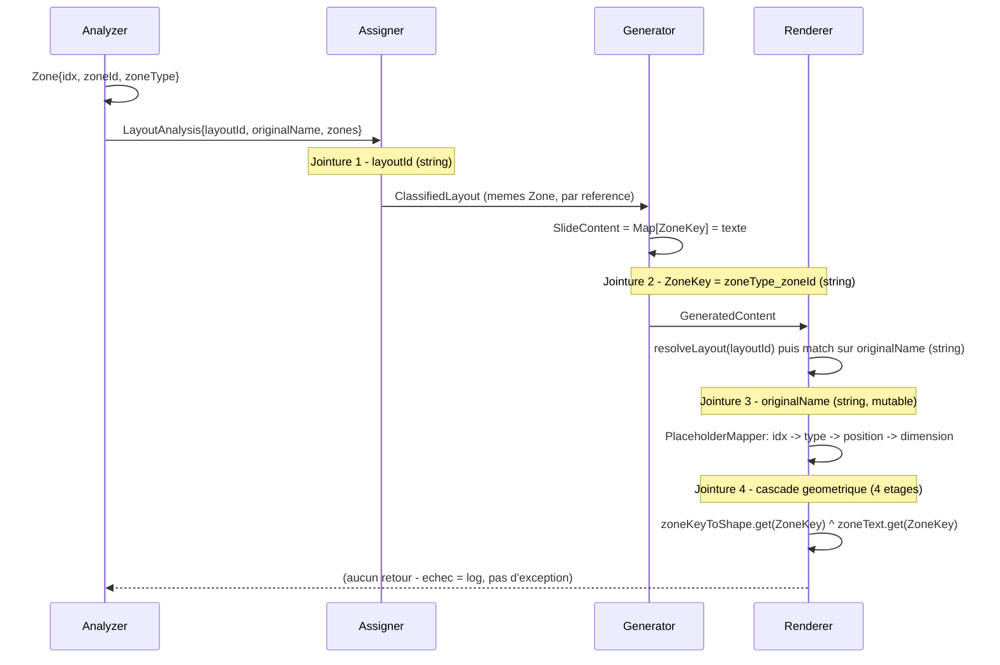

# Anatomie des zones : de l'analyse au rendu

> Document conceptuel (aucun code modifié). Explique comment un template PPTX devient
> une liste de `Zone`, comment ces zones sont remplies de contenu, et comment ce contenu
> retrouve sa place dans le fichier final — avec, à chaque saut, la clé qui relie les deux
> côtés et ce qui peut la casser. Se termine par des pistes d'amélioration.

---

## 0. Vue d'ensemble

Le pipeline traite un template PPTX vide en cinq étapes. Chaque flèche est un saut où une
information doit être retrouvée dans une autre structure de données — c'est précisément à
ces sauts que se loge la complexité du matching.



Le renderer (J) consomme deux entrées indépendantes : le `GeneratedContent` produit par le
generator, et le `TemplateAnalysis` produit tout au début par l'analyzer (flèche pointillée).
C'est cette double dépendance qui oblige à rejoindre les deux mondes par une clé.

Trois modules ont chacun leur propre notion d'identité de zone, que ce document relie :
`zoneId` (analyse), `idx` (OOXML), et `ZoneKey` (génération + rendu).

---

## 1. L'analyse

`TemplateAnalyzer` ouvre le PPTX vide et parcourt l'arbre XML de chaque layout. Pour chaque
forme qui est un *placeholder* avec une géométrie explicite, il construit un objet `Zone`.

| Champ | Origine | Stabilité | Utilisé pour |
|---|---|---|---|
| `idx` | Attribut OOXML `<p:ph idx="…">`, s'il existe | stable mais optionnel | Clé n°1 du matching au rendu |
| `zoneId` | Compteur incrémenté pendant le parcours XML | fragile — dépend de l'ordre des balises | Moitié de `ZoneKey`, tri en génération |
| `zoneType` | Type OOXML explicite, sinon heuristique `classifyBySize` | heuristique | Autre moitié de `ZoneKey`, filtre de type au rendu |
| `position` | Chaîne calculée (`"top: left"`...) | — | Prompts IA uniquement — **jamais lue par le rendu** |
| `polygon` / largeur / hauteur | Géométrie `xfrm` brute en EMU | stable si le template ne change pas | Repli position/dimension au rendu |

**À retenir** : le champ `position` (la chaîne `"top: left"`) et le matching géométrique
utilisé au rendu sont **deux calculs totalement indépendants** qui ne partagent aucun code.
C'est probablement la source de confusion : on a l'impression qu'une seule notion de
"position" traverse le pipeline, alors qu'il y en a deux, calculées séparément à partir du
même polygone.

*(`TemplateAnalyzer.java` — `identifyZones`, `describePosition`, `safeIdx`)*

---

## 2. La notion de `ZoneKey`

`ZoneKey` est la convention qui relie **ce que le générateur écrit** et **ce que le rendu
lit**. C'est une simple concaténation :

```
ZoneKey = zoneType + "_" + zoneId      ex: "title_0", "line_2"
```

Elle sert de clé dans **deux dictionnaires construits séparément, par deux stages différents,
à partir de deux sources différentes** — réconciliés seulement au moment de l'injection :



Le `ZoneKey` n'est **pas vérifié à la compilation** : c'est une convention textuelle partagée
par deux stages qui ne se voient jamais directement. Un décalage silencieux d'un seul côté
(ex. `zoneId` renuméroté) fait échouer la jointure sans erreur explicite.

Le Javadoc de `ZoneKeys` le dit lui-même : *« Both the content generators and the renderer
must use this exact format, otherwise zones silently fail to match »* — c'est un contrat de
nommage, pas un type vérifié.

*(`model/ZoneKeys.java`)*

---

## 3. La génération

`SlideContentGenerator` produit un `SlideContent` — concrètement une `Map<String, String>`
à plat, une entrée par `ZoneKey`. Deux chemins existent, et ils n'alimentent pas les zones
de la même façon :

| Chemin | Comment la zone est choisie | Fiabilité |
|---|---|---|
| Slides IA (contenu libre) | Le schéma JSON envoyé au LLM est construit à partir des `ZoneKey` exacts des zones du layout — le modèle est *contraint* à répondre avec ces clés. | clé explicite, imposée par schéma |
| Slides déterministes (outline, transition) | Les zones du layout sont filtrées par type, **triées par `zoneId`**, puis appariées **par position dans la liste** avec le contenu (la 3ᵉ zone `LINE` reçoit le 3ᵉ titre de section). | appariement positionnel, pas de clé |

**Point de fragilité** : le chemin déterministe ne référence jamais explicitement une zone —
il fait confiance à l'ordre de `zoneId`, qui dépend lui-même de l'ordre des balises XML au
moment de l'analyse. Si le template est réenregistré dans PowerPoint et que l'ordre des
formes change, le zip positionnel peut associer le mauvais contenu à la mauvaise zone
**sans qu'aucune erreur ne se déclenche**.

*(`pipeline/generator/SlideContentGenerator.java` — `generateOutline`, `generateSectionTransition`, `generateAiSlide`)*

---

## 4. L'assignation de layout

`LayoutAssignmentService` choisit, pour chaque slide du plan, quel `LayoutAnalysis`
utiliser : règles déterministes selon le type de slide, sinon un choix par IA parmi les
layouts utilisables, sinon un repli sur **le premier layout de la liste**
(`availableLayouts.get(0)`) si tout échoue. Le layout retenu est copié en `ClassifiedLayout`,
et sa liste de `Zone` est transmise **par référence** — ce sont exactement les mêmes objets
produits par l'analyse qui voyagent jusqu'au rendu, sans être recalculés.

*(`pipeline/assigner/LayoutAssignmentService.java`)*

---

## 5. Le rendu

Deux résolutions distinctes ont lieu ici.

### a. Retrouver le bon layout dans le fichier

`SlideFactory.resolveLayout` cherche le `LayoutAnalysis` par `layoutId`, récupère son
`originalName` (le nom affiché du layout au moment de l'analyse), puis parcourt **tous** les
`SlideLayoutPart` du fichier ouvert et prend celui dont le nom XML correspond *exactement*,
chaîne contre chaîne.

### b. Retrouver la bonne forme pour chaque zone

C'est `PlaceholderMapper`. La cascade réelle a **quatre étages**, pas trois — le filtre de
type est une étape obligatoire entre l'idx et la position :



Résolution nette : `R1`, `R2`. Résolution par repli géométrique (correcte mais silencieuse) :
`R3`, `R4`. Issues qui dégradent le résultat sans lever d'erreur : `X`, `F`.

**Fragilité confirmée** : le fichier importe `java.util.Comparator` mais ne l'utilise
jamais — trace d'un tri explicite envisagé puis abandonné. Le dernier repli (`.get(0)`) ne
journalise même pas qu'il y avait ambiguïté : c'est le point le plus imprévisible de toute
la chaîne.

*(`pipeline/renderer/SlideFactory.java`, `pipeline/renderer/PlaceholderMapper.java`)*

---

## 6. La chaîne bout-en-bout

Mise à plat, la chaîne effectue **quatre jointures indépendantes**, avec trois types de clés
différents, et aucune ne prévient les suivantes en cas d'échec :



Chaque jointure peut échouer indépendamment des trois autres, et chacune dégrade en silence
(log warning) plutôt que d'arrêter le rendu. C'est la combinaison des quatre — pas une seule
d'entre elles — qui rend le tout difficile à tracer.

---

## 7. Pourquoi c'est complexe

Le principe de base — retrouver une forme OOXML par son `idx` — est simple et justifié :
`idx` est un attribut optionnel en OOXML, un repli est nécessaire. La complexité vient de
trois choses qui s'additionnent, pas de la cascade elle-même :

1. **`zoneId` n'est pas un identifiant stable** — c'est un effet de bord de l'ordre de
   parcours XML, recalculé à chaque analyse, mais utilisé comme la moitié d'une clé métier
   (`ZoneKey`) et comme critère de tri pour l'appariement positionnel en génération.
2. **Les échecs sont muets partout** — zone non appariée, layout non résolu, tie-break
   arbitraire : tout redescend en `log.warn`, jamais en exception. Un problème à n'importe
   quel maillon produit un PPTX incomplet, pas une erreur qui pointe vers la cause.
3. **Quatre clés différentes, jamais vérifiées ensemble** — `layoutId`, `originalName`, la
   cascade géométrique, `ZoneKey`. Aucun type ni schéma ne garantit qu'elles restent
   synchronisées ; seule la convention documentée dans le Javadoc de `ZoneKeys` les relie.

---

## 8. Pistes d'amélioration

L'intuition de départ est la bonne piste : **si l'analyse enrichissait le template lui-même**
au lieu de produire seulement un JSON à côté, une bonne partie de la cascade au rendu
deviendrait inutile — la complexité arrêterait d'être répartie sur les deux extrémités du
pipeline.

### A. Garantir une identité stable par zone — persistée, pas seulement en mémoire

**Correction par rapport à une première version de cette piste** : assigner un `idx` en
mémoire pendant l'analyse ne suffit pas dès qu'un template déjà uploadé peut être réutilisé
plus tard, dans un autre appel — potentiellement un autre processus qui n'a jamais vu l'objet
en mémoire de l'analyse d'origine. Il faut donc que l'identité de chaque zone soit
**retrouvable à partir du fichier seul**, pas d'un état de session. Deux façons d'y arriver :

**A1 — Normaliser et persister une copie du template (écarté, voir plus bas).** À l'analyse (donc une seule fois, au
moment de l'upload), écrire un `idx` réel dans le XML des placeholders qui n'en ont pas, et
stocker cette copie normalisée comme *le* template utilisé pour toutes les générations/rendus
futurs de ce template (au lieu du fichier brut uploadé). L'écriture n'a lieu qu'une fois par
template, pas à chaque rendu.

> **Compromis** : nécessite d'écrire du XML avec docx4j de façon fiable (risque réel, à
> valider sur des vrais templates) et de gérer un nouvel artefact stocké ("template normalisé"
> vs "upload original"). En échange, `idx` devient un vrai attribut OOXML, lisible par
> n'importe quel outil, pas seulement par ce pipeline.

**A2 — Un seul calcul déterministe, partagé entre analyse et rendu, jamais persisté.** Ne pas
écrire dans le fichier : à la place, garantir qu'analyse et rendu appellent **exactement la
même fonction** pour attribuer un identifiant aux placeholders sans `idx` (ex. "le Nᵉ
placeholder valide rencontré en parcourant le XML dans cet ordre précis"). Tant que le fichier
template stocké est immuable une fois uploadé, cette fonction retombe toujours sur le même
résultat, à chaque appel, dans n'importe quel processus — pas besoin de mémoire partagée ni de
fichier réécrit, juste une seule implémentation utilisée aux deux endroits (au lieu de deux
implémentations séparées qui pourraient un jour diverger).

> **Compromis** : discipline de code plutôt que risque technique — il faut que ce soit
> *littéralement* la même fonction appelée des deux côtés (pas deux copies "censées faire
> pareil"), sinon on retombe exactement dans le problème actuel. Ne fonctionne que si le
> template stocké ne change jamais entre deux utilisations (à vérifier : upload immuable ou
> modifiable ?).

**Comparaison des deux flux, étape par étape :**

*Flux A1 :*
1. Template uploadé.
2. Analyse : pour chaque placeholder sans `idx`, on lui en attribue un **et on l'écrit dans
   le fichier** (le XML du template stocké est modifié).
3. Ce template corrigé devient la version utilisée à partir de maintenant — tout le monde a
   un `idx`.
4. Rendu (plus tard, une ou plusieurs fois) : les formes clonées portent déjà leur `idx`
   (copié avec le reste des attributs).
5. Injection : "cette forme a l'idx 3, je cherche le texte pour la zone d'idx 3" — terminé,
   aucun recalcul, aucun parcours de détection.

*Flux A2 :*
1. Template uploadé. **Le fichier n'est jamais modifié.**
2. Analyse : pour chaque placeholder sans `idx`, on **calcule** un numéro de substitution
   ("3ᵉ placeholder valide rencontré en parcourant le layout"), stocké seulement dans la
   donnée d'analyse (le JSON), jamais dans le PPTX.
3. Rendu (plus tard, une ou plusieurs fois) : le fichier original (jamais modifié) est
   rouvert. Une forme clonée sans `idx` réel n'a aucune info dessus.
4. Le rendu doit donc **refaire le même calcul** : reparcourir les formes dans le même ordre
   et compter jusqu'à la 3ᵉ — fiable seulement si c'est *exactement* le même code des deux
   côtés.

**En une phrase :** A1 résout le problème une fois pour toutes, au prix d'écrire dans le
fichier client. A2 ne touche jamais au fichier, au prix de refaire le calcul de détection à
chaque rendu (de façon fiable, mais refait quand même). C'est un vrai compromis
risque-d'écriture vs. travail-répété, pas une évidence dans un sens ou dans l'autre.

**Tranché** : un template déjà uploadé n'est jamais remplacé/modifié sans être ré-analysé —
c'est une règle du produit, pas une supposition. Donc le fichier stocké est bien immuable
entre deux utilisations, et **A2 suffit** : pas besoin de A1, pas besoin de toucher au fichier
PPTX ni de gérer un artefact "template normalisé" en plus de l'original. Le seul prérequis
est de faire respecter, dans le code, qu'analyse et rendu appellent la même fonction (pas deux
implémentations séparées).

### A3. Chercher-puis-cloner au rendu, au lieu de cloner-puis-chercher

Une fois l'identité garantie (A2), on peut supprimer la re-détection elle-même, pas
seulement la fiabiliser. Aujourd'hui le rendu clone *toutes* les formes du layout d'un coup,
puis reconstruit après coup deux dictionnaires séparés (`zoneKeyToShape` et `zoneText`) qu'il
faut ensuite faire correspondre par `ZoneKey` — c'est ce "detect / trier / mapper" après coup
qui est le vrai point de friction.

À la place : boucler directement sur la liste des `Zone` (déjà connue depuis l'analyse), et
pour **chaque zone**, dans une seule passe : retrouver sa forme d'origine par son identifiant
(garanti par A2), la cloner, puis injecter son texte immédiatement — sans construire ni
réconcilier deux dictionnaires séparés après coup.

> **Compromis** : restructure `PlaceholderMapper`/`PlaceholderInjector` (boucle unique par
> zone au lieu de deux passes), mais réduit le code net — plus de cascade, plus de tri, plus
> de jointure par `ZoneKey` côté rendu. Le `ZoneKey` resterait utilisé uniquement côté
> génération, là où il est réellement nécessaire (le contenu généré par l'IA arrive sous
> forme de JSON à plat).

### B. Dériver `zoneId` de `idx`, pas de l'ordre XML

Une fois A en place, `idx` devient stable et gravé dans le fichier lui-même (contrairement à
un compteur recalculé en mémoire). `ZoneKey` pourrait alors s'appuyer sur `idx` plutôt que
sur `zoneId` — la clé de jointure ne dépendrait plus de l'ordre de parcours du XML, donc un
réenregistrement du template dans PowerPoint ne renumérote plus rien silencieusement.

> **Compromis** : changement du format de `ZoneKey` — sans impact sur le résultat final si
> fait proprement, mais touche le contrat partagé generator/renderer documenté dans
> `ZoneKeys`, donc à faire en un seul commit atomique des deux côtés.

### C. Remplacer le nom de layout par un identifiant stable

`SlideFactory.resolveLayout` rejoint sur `originalName`, un nom affiché modifiable dans
PowerPoint. L'analyse pourrait à la place stamper chaque layout avec un identifiant technique
stable (attribut XML custom, ou s'appuyer sur le nom de `Part`/relationship id, déjà stable
dans le paquet OOXML) et le propager dans `LayoutAnalysis`, supprimant la comparaison de
chaîne fragile.

> **Compromis** : risque faible, gain de robustesse direct — bon candidat à faire
> indépendamment des idées A/B.

### D. Unifier l'appariement contenu ↔ zone en génération

Le chemin IA utilise déjà une clé explicite (schéma JSON par `ZoneKey`). Le chemin
déterministe (outline, transitions) pourrait faire pareil — choisir explicitement la zone
cible par son `ZoneKey`/`idx` plutôt que trier + zipper positionnellement. Un seul mécanisme
d'appariement dans tout le pipeline, au lieu de deux qui se ressemblent sans être liés.

> **Compromis** : demande de décider explicitement, dans chaque générateur déterministe,
> quelle zone reçoit quel rôle (ex. "la zone LINE la plus haute reçoit le premier titre") —
> un peu plus de code amont pour supprimer l'hypothèse implicite d'ordre.

### E. Rendre les échecs de jointure bruyants (au moins en debug)

Sans changer la résolution elle-même : journaliser explicitement *quel* étage de la cascade
a résolu chaque zone, et lever une alerte distincte (pas juste un `log.warn` parmi d'autres)
quand le tie-break arbitraire de la section 5b est atteint. Ça ne réduit pas la complexité du
code, mais ça la rend visible au lieu de silencieuse.

> **Compromis** : aucun changement de comportement de rendu — uniquement de
> l'observabilité. Le plus sûr et le plus rapide des cinq à mettre en place.

**Ordre suggéré** : **E** d'abord (zéro risque, révèle la fréquence réelle des replis), puis
**C**, puis **A2** (règle produit confirmée : un template déjà uploadé n'est jamais
remplacé/modifié sans être ré-analysé, donc pas besoin de A1), puis **A3** (conséquence
directe — la piste qui supprime réellement le re-matching côté rendu, pas juste le fiabiliser),
puis **B**, et **D** en dernier une fois que l'identité de zone est stabilisée.

---

## Références

- `src/main/java/com/pptxgenerator/pipeline/analyzer/TemplateAnalyzer.java`
- `src/main/java/com/pptxgenerator/pipeline/generator/SlideContentGenerator.java`
- `src/main/java/com/pptxgenerator/pipeline/assigner/LayoutAssignmentService.java`
- `src/main/java/com/pptxgenerator/pipeline/renderer/PlaceholderMapper.java`
- `src/main/java/com/pptxgenerator/pipeline/renderer/SlideFactory.java`
- `src/main/java/com/pptxgenerator/pipeline/renderer/PlaceholderInjector.java`
- `src/main/java/com/pptxgenerator/model/ZoneKeys.java`

Aucun test n'existe aujourd'hui sur `pipeline/analyzer`. Toute modification issue des pistes
ci-dessus doit être vérifiée par diff du `template_analysis.json` de debug avant/après, sur
plusieurs templates réels.
